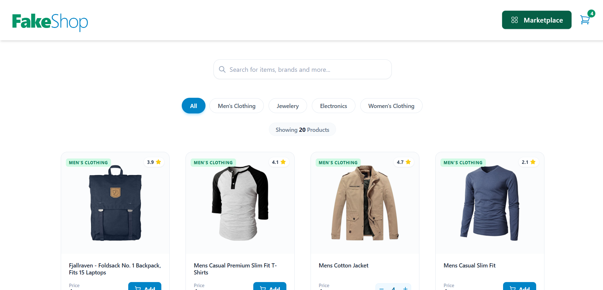
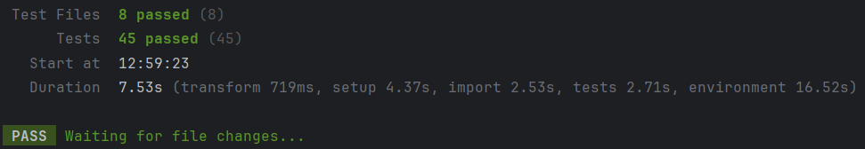

# FakeShop - Modern React E-commerce App

A fully responsive, functional shopping cart application. This project uses state management, routing, API, and unit testing.



## 🚀 Live Demo
[View Live Demo](https://shopping-cart-kapr534.vercel.app/)

## ✨ Features

- **Data Fetching:** Fetches data from [Fake Store API](https://fakestoreapi.com/).
- **Filtering & Search:** Filter products by category and search by name instantly.
- **Shopping Cart Logic:**
    - Add/Remove items.
    - Adjust quantities.
    - Automatic subtotal & total calculation.
    - **Shipping Logic:** Free shipping logic for orders over $500.
- **Responsive Design:** Optimized for Mobile, Tablet, and Desktop using Tailwind CSS.
- **Testing:** Fully tested using Vitest & React Testing Library.

## 🛠️ Tech Stack

- **Frontend:** React, TypeScript, Vite
- **Styling & Layout:** Tailwind CSS
- **Routing:** React Router DOM
- **State Management:** useState, React Context API
- **Icons:** Heroicons, Lucide React
- **Testing:** Vitest, React Testing Library (RTL)


## Project Structure

```bash
src/
├── assets/         # Static assets (images)
├── components/     # Reusable UI components (CartItem, ProductCard, Header...)
├── pages/          # Page views (Home, Marketplace, Cart, Success...)
├── tests/          # Unit tests
├── router.tsx      # Routing configuration
├── App.tsx         # Main layout & Global State logic
├── types.ts        # interface types
├── constants.ts    # stores constants
└── main.tsx        # Entry point
```

## Run Locally

1. Clone the project
```bash
   git clone https://github.com/Kapr534/Shopping-Cart.git
```
2. Go to the project directory
```bash
   cd Shopping-Cart
```
3. Install dependencies
```bash
   npm install
```
4. Start the server
```bash
   npm run dev
```

## What I learnt
I built this project to practice React, specifically using the Context API for the cart state management.
I also improved in testing and TypeScript.